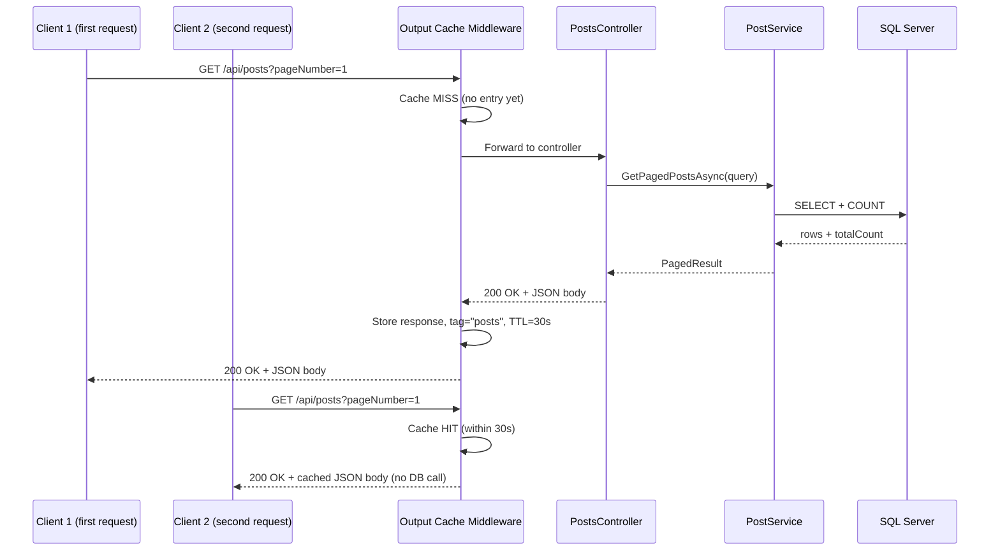
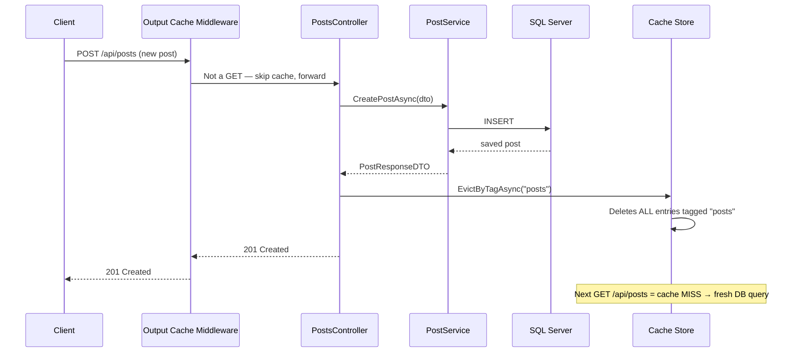

# Output Caching in DevConnect

## Status
✅ Implemented

---

## What is Output Caching?

Output Caching (ASP.NET Core 8+) stores the **complete HTTP response** — status code, headers, and body — and replays it for subsequent matching requests without re-executing the controller or hitting the database.

> Different from `IMemoryCache` (which caches C# objects inside the app) — output caching intercepts at the HTTP pipeline level.

---

## Files Involved

| File | Role |
|------|------|
| [DevConnect/Program.cs](../DevConnect/Program.cs) | Policy registration + `UseOutputCache` middleware |
| [DevConnect/Controllers/PostsController.cs](../DevConnect/Controllers/PostsController.cs) | `[OutputCache]` attribute on GET actions + `EvictByTagAsync` on write actions |

---

## How It Is Implemented

### Step 1 — Register Output Cache Service + Policy (`Program.cs`)
A named policy `"Posts"` is configured with a 30-second TTL and a tag for targeted invalidation:
```csharp
builder.Services.AddOutputCache(options =>
{
    options.AddPolicy("Posts", builder =>
        builder.Expire(TimeSpan.FromSeconds(30))
               .Tag("posts"));   // ← tag lets us evict all "posts" entries at once
});
```

---

### Step 2 — Add Middleware (`Program.cs`)
Placed **before** `UseAuthentication` so the cache can intercept unauthenticated public requests too:
```csharp
app.UseHttpsRedirection();
app.UseSerilogRequestLogging();
app.UseCors("AllowFrontend");
app.UseOutputCache();             // ← here
app.UseAuthentication();
app.UseAuthorization();
```

---

### Step 3 — Cache Read Endpoints (`PostsController.cs`)
The `[OutputCache]` attribute is applied to the two public GET endpoints:
```csharp
[HttpGet]
[OutputCache(PolicyName = "Posts")]              // caches paginated + sorted list
public async Task<IActionResult> GetAll([FromQuery] PostQueryParams query) =>
    Ok(await _postService.GetPagedPostsAsync(query));

[HttpGet("{id}")]
[OutputCache(PolicyName = "Posts")]              // caches single post
public async Task<IActionResult> GetById(int id)
{
    var post = await _postService.GetPostByIdAsync(id);
    return post == null ? NotFound() : Ok(post);
}
```

> `GET /api/posts/my` is **not cached** — it is `[Authorize]`-protected and returns per-user data.

---

### Step 4 — Invalidate Cache on Writes (`PostsController.cs`)
`IOutputCacheStore` is injected in the constructor and used to evict by tag after every successful write:
```csharp
private readonly IPostService _postService;
private readonly IOutputCacheStore _cache;       // ← injected

public PostsController(IPostService postService, IOutputCacheStore cache)
{
    _postService = postService;
    _cache = cache;
}

// CREATE — always evict (new post must appear immediately)
[HttpPost]
[Authorize]
public async Task<IActionResult> Create(CreatePostDTO dto)
{
    var userId = int.Parse(User.FindFirstValue(ClaimTypes.NameIdentifier)!);
    var post   = await _postService.CreatePostAsync(userId, dto);
    await _cache.EvictByTagAsync("posts", HttpContext.RequestAborted);   // ← evict
    return CreatedAtAction(nameof(GetById), new { id = post.Id }, post);
}

// UPDATE — evict only if update actually succeeded
[HttpPut("{id}")]
[Authorize]
public async Task<IActionResult> Update(int id, CreatePostDTO dto)
{
    var userId = int.Parse(User.FindFirstValue(ClaimTypes.NameIdentifier)!);
    var result = await _postService.UpdatePostAsync(id, userId, dto);
    if (result) await _cache.EvictByTagAsync("posts", HttpContext.RequestAborted);  // ← evict
    return result ? NoContent() : NotFound();
}

// DELETE — evict only if delete actually succeeded
[HttpDelete("{id}")]
[Authorize]
public async Task<IActionResult> Delete(int id)
{
    var userId = int.Parse(User.FindFirstValue(ClaimTypes.NameIdentifier)!);
    var role   = User.FindFirstValue(ClaimTypes.Role)!;
    var result = await _postService.DeletePostAsync(id, userId, role);
    if (result) await _cache.EvictByTagAsync("posts", HttpContext.RequestAborted);  // ← evict
    return result ? NoContent() : NotFound();
}
```

---

## Which Endpoints Are Cached?

| Endpoint | Cached? | Reason |
|----------|---------|--------|
| `GET /api/posts` | ✅ Yes | Public, same response for all anonymous callers |
| `GET /api/posts/{id}` | ✅ Yes | Public, deterministic by id |
| `GET /api/posts/my` | ❌ No | `[Authorize]` — returns different data per user |
| `POST /api/posts` | ❌ No (evicts) | Write — invalidates cached list |
| `PUT /api/posts/{id}` | ❌ No (evicts) | Write — cached entry would be stale |
| `DELETE /api/posts/{id}` | ❌ No (evicts) | Write — deleted post must not reappear |

---

## Cache Hit / Miss Flow Diagram



---

## Invalidation Flow Diagram



---

## Key Points

- `Expire(30s)` — cached responses auto-expire after 30 seconds even without a write.
- `Tag("posts")` — a single `EvictByTagAsync("posts")` clears **all** cached responses (both `GetAll` and all `GetById` entries) at once.
- Eviction on Update/Delete is guarded by `if (result)` — no unnecessary cache flush when the operation fails (not found / not owner).
- Output cache is stored **in-process** by default — consider Redis-backed distributed cache for multi-instance deployments.

