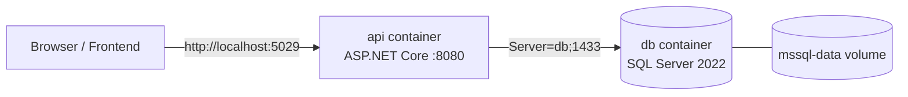

# Docker — DevConnect Backend

This guide explains how the DevConnect ASP.NET Core Web API and its SQL Server database run in Docker.

## What's included

| File | Purpose |
| --- | --- |
| `DevConnect/Dockerfile` | Multi-stage build (SDK → ASP.NET runtime) that produces the API image. |
| `DevConnect/.dockerignore` | Keeps `bin/`, `obj/`, `Logs/`, and dev secrets out of the build context. |
| `docker-compose.yml` | Orchestrates the API + SQL Server 2022 with a health check and a persisted volume. |
| `Program.cs` (auto-migrate block) | Applies EF Core migrations on startup when `RunMigrationsAtStartup=true`. |

## Architecture



- The **api** container listens on port `8080` (HTTP only, no dev cert needed) and is published to host port `5029`.
- The **db** container is SQL Server 2022, published to host port `1433`, with data persisted in the `mssql-data` volume.
- The API reaches the database using the service name `db` as the host.

## How it works

### 1. Image build (`DevConnect/Dockerfile`)

- **Build stage** (`mcr.microsoft.com/dotnet/sdk:8.0`): restores packages first (for layer caching), then `dotnet publish -c Release`.
- **Runtime stage** (`mcr.microsoft.com/dotnet/aspnet:8.0`): copies the published output and starts `dotnet DevConnect.dll`.
- `ASPNETCORE_URLS=http://+:8080` makes Kestrel listen on HTTP inside the container.

### 2. Connection string override

Your local `appsettings.Development.json` uses **Windows Integrated Security**, which cannot work inside a Linux container. `docker-compose.yml` overrides the connection string with SQL authentication via an environment variable:

```
ConnectionStrings__DefaultConnection=Server=db;Database=DevConnect;User Id=sa;Password=Your_strong_Passw0rd!;TrustServerCertificate=True;Encrypt=False
```

The double-underscore (`__`) maps to the nested `ConnectionStrings:DefaultConnection` config key.

### 3. Automatic migrations

On startup, when `RunMigrationsAtStartup=true` (set in compose), the API applies EF Core migrations for **both** DbContexts so the schema — including the Bookmarks table — is created automatically:

```csharp
if (app.Configuration.GetValue<bool>("RunMigrationsAtStartup"))
{
    using var scope = app.Services.CreateScope();
    var services = scope.ServiceProvider;
    services.GetRequiredService<FirstAPIContext>().Database.Migrate();
    services.GetRequiredService<DevConnectDbContext>().Database.Migrate();
}
```

Local `dotnet run` is unaffected unless you explicitly set the flag.

## Running it

Run all commands from the solution root: `c:\Philips\Other\C#And.NetPractice\DevConnect`.

Build and start everything:

```powershell
docker compose up --build
```

Start in the background:

```powershell
docker compose up --build -d
```

Endpoints once running:

- API: http://localhost:5029
- Swagger: http://localhost:5029/swagger
- SQL Server: `localhost,1433` — user `sa`, password `Your_strong_Passw0rd!`

## Common commands

```powershell
docker compose ps                 # list running services
docker compose logs -f api        # follow API logs
docker compose logs -f db         # follow database logs
docker compose stop               # stop containers (keep data)
docker compose down               # stop and remove containers (keep data)
docker compose down -v            # stop and WIPE the database volume
docker compose build api          # rebuild only the API image
docker compose up -d --build api  # rebuild + restart only the API
```

## Frontend integration

The API runs over HTTP at `http://localhost:5029`, which is already one of the fallback URLs in `devconnectwebapp/lib/api.ts`. No extra config is needed for local development. To pin it explicitly, set in the web app:

```
NEXT_PUBLIC_API_BASE_URL=http://localhost:5029
```

## Troubleshooting

- **API can't connect to the database at first boot** — SQL Server takes time to become ready. The compose `depends_on: condition: service_healthy` + health check waits for it; if the API still starts too early, run `docker compose restart api`.
- **Login/schema errors** — ensure `RunMigrationsAtStartup=true` is set (it is in compose) so migrations run, or wipe and recreate with `docker compose down -v` then `docker compose up --build`.
- **Port already in use (5029 / 1433)** — stop the local API/SQL Server instance, or change the host port mappings in `docker-compose.yml`.
- **HTTPS redirect warnings** — expected; the container serves HTTP only and does not use a dev certificate.

## Security notes

- `Your_strong_Passw0rd!` is a local development password only. Change it (and inject it via a secret, not the compose file) before using this anywhere shared or in production.
- The `sa` account is used for convenience in development. Prefer a least-privilege SQL login for non-local environments.
- Do not commit real JWT keys, OAuth client secrets, or connection strings to source control.
