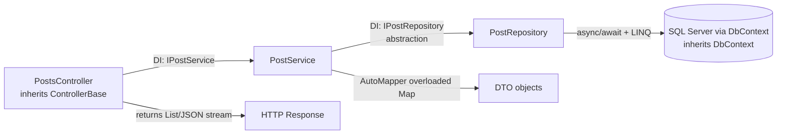

# OOP & C# Core Concepts — DevConnect

A single reference that maps each core Object-Oriented Programming (OOP) and C# concept to a **real implementation** inside the DevConnect codebase.

For every concept you get:

- **Definition** — what it is, in plain words.
- **Example** — the actual production code from this project (with file path).
- **What / Where / Why** — what concept is implemented, where it lives, and why it was implemented (the use case & benefit).

> Legend: 🟢 = definition · 🧩 = real code · 💡 = why / benefit / use case

---

## Table of Contents

1. [Class](#1-class)
2. [Constructor & Types of Constructors](#2-constructor--types-of-constructors)
3. [Object](#3-object)
4. [Data Abstraction — Interface](#4-data-abstraction--interface)
5. [Data Encapsulation — Method, Constructor, Properties](#5-data-encapsulation--method-constructor-properties)
6. [Polymorphism](#6-polymorphism)
7. [Method Overloading](#7-method-overloading)
8. [Method Overriding](#8-method-overriding)
9. [Inheritance](#9-inheritance)
10. [Abstract Class vs Interface](#10-abstract-class-vs-interface)
11. [Dependency Injection](#11-dependency-injection)
12. [async / await](#12-async--await)
13. [Array](#13-array)
14. [String](#14-string)
15. [Collections — List & Dictionary](#15-collections--list--dictionary)
16. [LINQ](#16-linq)
17. [Streams](#17-streams)
18. [Quick Interview Cheat Sheet](#18-quick-interview-cheat-sheet)

---

## 1. Class

🟢 **Definition:** A class is a blueprint that bundles **data (fields/properties)** and **behavior (methods)** into a single unit. Objects are created from classes.

🧩 **Real code** — `DevConnect/Services/PostService.cs`

```csharp
public class PostService : IPostService
{
    private readonly IPostRepository _repo;   // data
    private readonly IMapper _mapper;

    public PostService(IPostRepository repo, IMapper mapper) { ... }

    // behavior
    public async Task<List<PostResponseDTO>> GetAllPostsAsync()
    {
        var posts = await _repo.GetAllAsync();
        return _mapper.Map<List<PostResponseDTO>>(posts);
    }
}
```

💡 **What / Where / Why**
- **What:** `PostService` is a class that groups all post-related business logic.
- **Where:** `Services/PostService.cs`, `Models/User.cs`, `Models/Post.cs`, every controller.
- **Why:** Keeps related logic together (single responsibility), makes the code reusable and testable, and lets the DI container hand one clean unit to controllers.

---

## 2. Constructor & Types of Constructors

🟢 **Definition:** A constructor is a special method that runs when an object is created, used to initialize its state. It has the same name as the class and no return type.

**Types used in this project:**

| Type | Meaning | Example location |
|------|---------|------------------|
| **Parameterized / DI constructor** | Takes arguments to initialize dependencies | `PostService`, all controllers |
| **Default (implicit) constructor** | No parameters; compiler-generated for DTOs/models | `User`, `Post`, DTOs |
| **Base-calling constructor** | Passes args up to the base class with `: base(...)` | `DevConnectDbContext` |

🧩 **Real code** — parameterized (dependency-injected) constructor, `DevConnect/Services/AuthService.cs`

```csharp
public class AuthService : IAuthService
{
    private readonly DevConnectDbContext _context;
    private readonly IConfiguration _config;

    // Parameterized constructor — dependencies injected by the DI container
    public AuthService(DevConnectDbContext context, IConfiguration config)
    {
        _context = context;
        _config = config;
    }
}
```

🧩 **Real code** — base-calling constructor, `DevConnect/Data/DevConnectDbContext.cs`

```csharp
public class DevConnectDbContext : DbContext
{
    // Passes options up to the DbContext base constructor
    public DevConnectDbContext(DbContextOptions<DevConnectDbContext> options)
        : base(options) { }
}
```

💡 **What / Where / Why**
- **What:** Constructors initialize an object's required dependencies/state.
- **Where:** `AuthService.cs`, `PostService.cs`, `PostRepository.cs`, every controller, `DevConnectDbContext.cs`.
- **Why:** The parameterized constructor enables **constructor injection** — the class declares what it needs and the framework supplies it. `: base(options)` forwards EF Core configuration to the parent.

---

## 3. Object

🟢 **Definition:** An object is a concrete instance of a class created (usually) with the `new` keyword. The class is the blueprint; the object is the actual thing in memory.

🧩 **Real code** — `DevConnect/Services/AuthService.cs`

```csharp
// Creating (instantiating) a new User object from OIDC data
var newUser = new User
{
    Name = dto.Name,
    Email = dto.Email,
    Provider = dto.Provider,
    ProviderUserId = dto.ProviderUserId,
    Role = "User",
    PasswordHash = null
};

_context.Users.Add(newUser);
await _context.SaveChangesAsync();
```

💡 **What / Where / Why**
- **What:** `newUser` is an object (instance) of the `User` class.
- **Where:** `AuthService.FindOrCreateOidcUserAsync`, JWT token creation (`new JwtSecurityToken(...)`), `new PagedResult<...>()` in `PostService`.
- **Why:** We need real, in-memory data to persist to the database or return to the caller. Objects hold that live data.

---

## 4. Data Abstraction — Interface

🟢 **Definition:** Abstraction means exposing **what** an object does while hiding **how** it does it. In C#, interfaces are the primary abstraction tool — they define a contract (method signatures) with no implementation.

🧩 **Real code** — `DevConnect/Interfaces/IPostRepository.cs`

```csharp
public interface IPostRepository
{
    Task<List<Post>> GetAllAsync();
    Task<Post?> GetByIdAsync(int id);
    Task<Post> CreateAsync(Post post);
    Task UpdateAsync(Post post);
    Task DeleteAsync(Post post);
    Task<(List<Post> Posts, int TotalCount)> GetPagedAsync(PostQueryParams query);
}
```

The consumer depends only on the interface:

```csharp
// PostService.cs — depends on the abstraction, not the concrete PostRepository
private readonly IPostRepository _repo;
```

💡 **What / Where / Why**
- **What:** `IPostRepository`, `IPostService`, `IAuthService` are abstractions.
- **Where:** `Interfaces/` folder; consumed by services and controllers.
- **Why:** Callers don't care whether data comes from SQL Server, an in-memory list, or a mock. This enables **loose coupling**, easy **unit testing** (swap in a fake repo), and lets you change the DB layer without touching business logic.

---

## 5. Data Encapsulation — Method, Constructor, Properties

🟢 **Definition:** Encapsulation hides internal state behind a controlled public surface. Fields are kept `private`; access is granted through **properties** (get/set), **constructors**, and **methods**.

🧩 **Real code** — private fields exposed only through behavior, `DevConnect/Repositories/PostRepository.cs`

```csharp
public class PostRepository : IPostRepository
{
    private readonly DevConnectDbContext _context;   // hidden internal state

    public PostRepository(DevConnectDbContext context) // controlled init
    {
        _context = context;
    }

    // The only way outsiders interact with _context is via methods
    public async Task<Post> CreateAsync(Post post)
    {
        _context.Posts.Add(post);
        await _context.SaveChangesAsync();
        return post;
    }
}
```

🧩 **Real code** — properties, `DevConnect/Models/User.cs`

```csharp
public class User
{
    public int Id { get; set; }
    public string Name { get; set; }
    public string Email { get; set; }
    public string PasswordHash { get; set; } = string.Empty;
    public string Role { get; set; } = "User";      // default value
    public string? Provider { get; set; }            // nullable property
}
```

💡 **What / Where / Why**
- **What:** `_context`/`_config` are private fields (hidden); `Name`, `Email`, etc. are properties (controlled access).
- **Where:** Every service/repository (private `_` fields) and every model/DTO (properties).
- **Why:** Nobody outside `PostRepository` can touch the DB context directly — they must go through `CreateAsync`/`UpdateAsync`. This protects invariants, centralizes logic, and makes the class safe to change internally.

---

## 6. Polymorphism

🟢 **Definition:** Polymorphism ("many forms") lets one reference type point to many concrete implementations, so the **same call** produces **different behavior** depending on the runtime object.

🧩 **Real code** — `Program.cs` binds the interface to a concrete type; consumers call through the interface

```csharp
// Program.cs
builder.Services.AddScoped<IPostRepository, PostRepository>();
builder.Services.AddScoped<IPostService, PostService>();
builder.Services.AddScoped<IAuthService, AuthService>();
```

```csharp
// PostService.cs — _repo is typed as IPostRepository, but at runtime it IS a PostRepository.
// Swap the registration to a mock and the same code runs a different implementation.
var posts = await _repo.GetAllAsync();
```

💡 **What / Where / Why**
- **What:** `IPostRepository _repo` behaves polymorphically — real repo in production, mock in tests.
- **Where:** `Program.cs` registrations + every service/controller that depends on an interface.
- **Why:** The business code is written once against the contract. In `DevConnect.Tests` a fake implementation is injected, so the **same** `PostService` code is tested without a real database. This is runtime (subtype) polymorphism.

---

## 7. Method Overloading

🟢 **Definition:** Overloading = multiple methods with the **same name** but **different parameter lists**, resolved at **compile time**. It improves readability by giving related operations one name.

🧩 **Real code** — AutoMapper's `Map` is overloaded and both overloads are used in `DevConnect/Services/PostService.cs`

```csharp
// Overload 1: Map<TDestination>(source) → creates a new object
return _mapper.Map<List<PostResponseDTO>>(posts);

// Overload 2: Map(source, destination) → maps ONTO an existing object
_mapper.Map(dto, post);   // update existing 'post' with values from 'dto'
```

Framework methods overloaded across the project include `OrderBy` / `OrderByDescending`, and `Math.Clamp(value)` vs `Math.Max(a, b)`.

💡 **What / Where / Why**
- **What:** Two different `Map` signatures — create-new vs map-onto-existing.
- **Where:** `PostService.CreatePostAsync` (create) and `PostService.UpdatePostAsync` (map onto existing).
- **Why:** One intuitive name (`Map`) handles both "produce a new DTO" and "update an entity in place," so the code reads naturally and the compiler picks the right one by argument types.

---

## 8. Method Overriding

🟢 **Definition:** Overriding = a derived class provides its **own implementation** of a `virtual`/`abstract` method inherited from a base class, using the `override` keyword. Resolved at **runtime**.

🧩 **Real code** — `DevConnect/Data/DevConnectDbContext.cs`

```csharp
public class DevConnectDbContext : DbContext
{
    // Override the base DbContext behavior to configure the model
    protected override void OnModelCreating(ModelBuilder modelBuilder)
    {
        base.OnModelCreating(modelBuilder);   // keep base behavior, then extend

        modelBuilder.Entity<Like>()
            .HasIndex(l => new { l.PostId, l.UserId })
            .IsUnique();   // prevent duplicate likes
    }
}
```

💡 **What / Where / Why**
- **What:** `OnModelCreating` overrides the virtual method defined in EF Core's `DbContext`.
- **Where:** `DevConnectDbContext.cs`.
- **Why:** EF Core calls `OnModelCreating` internally during model building. By overriding it we inject our own rules (relationships, cascade deletes, unique index) **without** modifying the framework — a textbook use of overriding for extensibility.

---

## 9. Inheritance

🟢 **Definition:** Inheritance lets a class (**derived/child**) reuse and extend the members of another class (**base/parent**) using the `: BaseClass` syntax. It models an "is-a" relationship.

🧩 **Real code** — controllers inherit `ControllerBase`; DbContext inherits `DbContext`; validators inherit `AbstractValidator<T>`

```csharp
// Controllers/PostsController.cs
public class PostsController : ControllerBase   // gets Ok(), NotFound(), User, etc. for free
{ ... }

// Data/DevConnectDbContext.cs
public class DevConnectDbContext : DbContext    // gets change tracking, SaveChanges, DbSet<T>
{ ... }

// Validators/AuthValidators.cs
public class RegisterValidator : AbstractValidator<RegisterDTO>  // gets RuleFor(), validation engine
{ ... }
```

💡 **What / Where / Why**
- **What:** `PostsController` **is-a** `ControllerBase`; `DevConnectDbContext` **is-a** `DbContext`.
- **Where:** All controllers, `DevConnectDbContext.cs`, all validators.
- **Why:** We inherit thousands of lines of tested framework behavior (HTTP helpers, EF change tracking, validation pipeline) and only add our specifics. Massive reuse with zero duplication.

---

## 10. Abstract Class vs Interface

🟢 **Definition:**
- **Interface** = a pure contract (no state, no implementation*). A class can implement **many** interfaces.
- **Abstract class** = a partial base that **can** hold state and shared implementation, but **cannot** be instantiated. A class inherits from **one** abstract class.

| Feature | Interface | Abstract Class |
|--------|-----------|----------------|
| Instantiable? | No | No |
| Fields/State | No | Yes |
| Implementation | Contract only* | Can provide shared code |
| Multiple inheritance | Yes (many) | No (single) |
| Use when | Defining a capability/contract | Sharing base code among related types |

🧩 **Interface in this project** — `Interfaces/IAuthService.cs`

```csharp
public interface IAuthService
{
    string GenerateToken(User user);                  // contract only
    Task<User> FindOrCreateOidcUserAsync(OidcUserDTO dto);
}
```

🧩 **Abstract class in this project** — `AbstractValidator<T>` (from FluentValidation) is an abstract base we inherit:

```csharp
// RegisterValidator inherits shared validation machinery from the abstract base
public class RegisterValidator : AbstractValidator<RegisterDTO>
{
    public RegisterValidator()
    {
        RuleFor(x => x.Email).NotEmpty().EmailAddress();
    }
}
```

💡 **What / Where / Why**
- **What:** `IAuthService`/`IPostRepository` are contracts; `AbstractValidator<T>` is an abstract base providing shared behavior.
- **Where:** `Interfaces/` (our interfaces); `Validators/` (inherit abstract base).
- **Why:** We use **interfaces** for our own services because we only need a swappable contract for DI/testing (and a class may need several). We rely on an **abstract class** (`AbstractValidator<T>`) when we want ready-made shared logic (`RuleFor`, error collection) that each validator extends.

\* Modern C# allows default interface methods, but this project keeps interfaces as pure contracts.

---

## 11. Dependency Injection

🟢 **Definition:** DI is a pattern where a class receives its dependencies from the outside (usually via constructor) instead of creating them itself. A **container** wires everything up. This is "Inversion of Control."

🧩 **Real code** — registration, `DevConnect/Program.cs`

```csharp
builder.Services.AddScoped<IPostRepository, PostRepository>(); // one per HTTP request
builder.Services.AddScoped<IPostService, PostService>();
builder.Services.AddScoped<IAuthService, AuthService>();
builder.Services.AddAutoMapper(typeof(MappingProfile));
builder.Services.AddDbContext<DevConnectDbContext>(o =>
    o.UseSqlServer(builder.Configuration.GetConnectionString("DefaultConnection")));
```

🧩 **Real code** — consumption via constructor injection, `DevConnect/Controllers/PostsController.cs`

```csharp
public class PostsController : ControllerBase
{
    private readonly IPostService _postService;   // interface, not concrete class
    private readonly IOutputCacheStore _cache;

    // The container supplies both dependencies automatically
    public PostsController(IPostService postService, IOutputCacheStore cache)
    {
        _postService = postService;
        _cache = cache;
    }
}
```

💡 **What / Where / Why**
- **What:** Controllers/services declare interfaces in their constructor; the container injects concrete instances.
- **Where:** Registered in `Program.cs`; consumed in every controller, `PostService`, `AuthService`, `PostRepository`.
- **Why:** Removes `new` from business code, enforces loose coupling, and makes unit testing trivial (inject mocks). `Scoped` lifetime also guarantees one `DbContext` per request — critical for EF Core correctness.

---

## 12. async / await

🟢 **Definition:** `async`/`await` enables non-blocking asynchronous code. `await` releases the current thread while an I/O operation (DB, network, file) completes, then resumes — dramatically improving scalability.

🧩 **Real code** — `DevConnect/Repositories/PostRepository.cs`

```csharp
public async Task<Post> CreateAsync(Post post)
{
    _context.Posts.Add(post);
    await _context.SaveChangesAsync();   // thread freed while DB writes
    return post;
}
```

🧩 **Real code** — chained through the layers, `Controllers/PostsController.cs`

```csharp
[HttpPost]
[Authorize]
public async Task<IActionResult> Create(CreatePostDTO dto)
{
    var userId = int.Parse(User.FindFirstValue(ClaimTypes.NameIdentifier)!);
    var post = await _postService.CreatePostAsync(userId, dto);
    await _cache.EvictByTagAsync("posts", HttpContext.RequestAborted);
    return CreatedAtAction(nameof(GetById), new { id = post.Id }, post);
}
```

💡 **What / Where / Why**
- **What:** Every DB call (`SaveChangesAsync`, `ToListAsync`, `FirstOrDefaultAsync`) is awaited.
- **Where:** Controllers → Services → Repository — the async chain runs end-to-end.
- **Why:** A web API spends most of its time waiting on the database. `async` lets the server handle many concurrent requests with few threads instead of blocking one thread per request — the key to **scalability** and **throughput**.

---

## 13. Array

🟢 **Definition:** An array is a **fixed-size**, contiguous collection of elements of the same type, accessed by index.

🧩 **Real code** — `DevConnect/Services/AuthService.cs` (JWT claims)

```csharp
var claims = new[]   // fixed-size array of Claim
{
    new Claim(ClaimTypes.NameIdentifier, user.Id.ToString()),
    new Claim(ClaimTypes.Name, user.Name),
    new Claim(ClaimTypes.Email, user.Email),
    new Claim(ClaimTypes.Role, user.Role),
    new Claim("provider", user.Provider ?? "Local")
};
```

🧩 **Real code** — `Program.cs` (Swagger security requirement)

```csharp
Array.Empty<string>()   // an empty array, allocation-free
```

💡 **What / Where / Why**
- **What:** A `Claim[]` holds a known, fixed set of identity claims for the token.
- **Where:** `AuthService.GenerateToken`, `AuthController.GenerateToken`, `Program.cs`.
- **Why:** The number of claims is known and never changes after creation, so a fixed array is the most efficient container. `Array.Empty<string>()` avoids allocating a throwaway empty array.

---

## 14. String

🟢 **Definition:** A `string` is an **immutable** sequence of characters. Any "modification" produces a new string. C# offers rich methods and interpolation for manipulation.

🧩 **Real code** — parsing and comparison, `DevConnect/Repositories/PostRepository.cs`

```csharp
// Normalize case before comparing sort keys
q = (query.SortBy.ToLower(), query.SortDirection.ToLower()) switch
{
    ("title", "asc")  => q.OrderBy(p => p.Title),
    ("likes", "asc")  => q.OrderBy(p => p.Likes.Count),
    _                 => q.OrderByDescending(p => p.CreatedAt),
};
```

🧩 **Real code** — default values & null-coalescing, models/services

```csharp
public string Title { get; set; } = string.Empty;          // Post.cs
new Claim("provider", user.Provider ?? "Local");           // AuthService.cs
```

💡 **What / Where / Why**
- **What:** Strings drive sort keys, roles, tokens, emails, and messages.
- **Where:** `PostRepository` (`ToLower` for case-insensitive sorting), models (`= string.Empty` defaults), `AuthController` (roles/emails), validators (regex on `Password`).
- **Why:** `ToLower()` makes API sort params case-insensitive; `= string.Empty` prevents null reference bugs; `??` supplies a safe fallback. String handling here guards correctness and robustness at system boundaries.

---

## 15. Collections — List & Dictionary

🟢 **Definition:**
- **`List<T>`** — a dynamic, ordered, resizable collection accessed by index.
- **`Dictionary<TKey,TValue>`** — an unordered collection of key→value pairs with fast (O(1)) lookup by key.

🧩 **Real code** — `List<T>`, `DevConnect/Models/User.cs` & `PostRepository.cs`

```csharp
// Navigation collection — a user's many posts
public List<Post> Posts { get; set; } = new();

// Query result materialized into a List
public async Task<List<Post>> GetAllAsync() =>
    await _context.Posts.Include(p => p.User).ToListAsync();
```

🧩 **Real code** — `Dictionary`-style key/value config objects, `Program.cs`

```csharp
// OpenApiSecurityRequirement is a dictionary of scheme → scopes
options.AddSecurityRequirement(new OpenApiSecurityRequirement
{
    {
        new OpenApiSecurityScheme { Reference = new OpenApiReference { ... } },
        Array.Empty<string>()   // value
    }
});
```

> `ICollection<Like>` / `ICollection<Comment>` on `Post`/`User` are the interface-typed collection abstractions EF Core populates.

💡 **What / Where / Why**
- **What:** `List<Post>` holds ordered query results and navigation data; dictionary-style structures hold keyed config.
- **Where:** Models (navigation props), `PostRepository`/`PostService` (`List<PostResponseDTO>`), `Program.cs` (Swagger/security dictionaries).
- **Why:** `List<T>` is the natural fit for "many rows" from the DB (ordered, iterable, count for likes). Dictionary/keyed structures give instant lookup by key where identity matters (security schemes, configuration).

---

## 16. LINQ

🟢 **Definition:** LINQ (Language-Integrated Query) provides SQL-like query operators (`Where`, `Select`, `OrderBy`, `FirstOrDefault`, `Any`, `Count`, `Skip`, `Take`) over collections and databases in a readable, composable way. With EF Core, LINQ is translated to SQL.

🧩 **Real code** — filtering, paging & sorting, `DevConnect/Repositories/PostRepository.cs`

```csharp
public async Task<(List<Post> Posts, int TotalCount)> GetPagedAsync(PostQueryParams query)
{
    var q = _context.Posts
        .Include(p => p.User)
        .Include(p => p.Likes)
        .AsQueryable();

    q = query.SortBy.ToLower() switch
    {
        "likes" => q.OrderByDescending(p => p.Likes.Count),
        _       => q.OrderByDescending(p => p.CreatedAt),
    };

    var totalCount = await q.CountAsync();

    var posts = await q
        .Skip((query.PageNumber - 1) * query.PageSize)   // paging
        .Take(query.PageSize)
        .ToListAsync();

    return (posts, totalCount);
}
```

🧩 **Real code** — lookups, `AuthController.cs` / `AuthService.cs`

```csharp
if (await _context.Users.AnyAsync(u => u.Email == dto.Email)) ...      // existence check
var user = await _context.Users.FirstOrDefaultAsync(u => u.Email == dto.Email);
var email = claims?.FirstOrDefault(c => c.Type == ClaimTypes.Email)?.Value; // in-memory LINQ
```

💡 **What / Where / Why**
- **What:** `Where`, `OrderBy(Descending)`, `Skip`, `Take`, `Count`, `Any`, `FirstOrDefault`.
- **Where:** `PostRepository` (paging/sorting/includes), `AuthController`/`AuthService` (email lookups, claim extraction).
- **Why:** LINQ expresses complex data queries declaratively; EF Core turns them into efficient SQL (paging happens **in the database**, not memory). It also filters in-memory collections (claims). Result: less code, fewer bugs, one query language for DB and objects.

---

## 17. Streams

🟢 **Definition:** A stream is an abstraction over a sequence of bytes read/written incrementally (files, network, memory) — you don't load everything at once. In ASP.NET the request/response bodies, logging sinks, and file logs are all stream-based.

🧩 **Real code** — Serilog writes logs to rolling file **streams**, configured in `DevConnect/Program.cs` (+ `appsettings.json`)

```csharp
Log.Logger = new LoggerConfiguration()
    .ReadFrom.Configuration(new ConfigurationBuilder()
        .AddJsonFile("appsettings.json")
        .Build())
    .CreateBootstrapLogger();

builder.Host.UseSerilog((ctx, services, config) =>
    config.ReadFrom.Configuration(ctx.Configuration)
          .ReadFrom.Services(services));
```

🧩 **Real code** — byte/stream-based token signing, `AuthService.cs`

```csharp
// Text encoded to a byte buffer (stream of bytes) for the signing key
var key = new SymmetricSecurityKey(
    Encoding.UTF8.GetBytes(_config["JwtSettings:Key"]!));
```

The HTTP pipeline itself streams the JSON response body:

```csharp
return Ok(await _postService.GetPagedPostsAsync(query)); // serialized to the response stream
```

💡 **What / Where / Why**
- **What:** Serilog file sink streams log entries to disk (`Logs/`); `Encoding.UTF8.GetBytes` produces the byte buffer for JWT signing; ASP.NET streams request/response bodies.
- **Where:** `Program.cs` (Serilog), `Logs/` folder output, `AuthService`/`AuthController` (byte encoding), the whole MVC pipeline.
- **Why:** Streaming lets logs be written continuously without buffering everything in memory, and lets large HTTP payloads flow efficiently. It keeps memory usage flat regardless of data size — essential for a production web API.

---

## 18. Quick Interview Cheat Sheet

| Concept | One-liner | Where in DevConnect |
|--------|-----------|---------------------|
| Class | Blueprint of data + behavior | `PostService`, `User` |
| Constructor | Initializes an object | DI ctors in every service/controller |
| Object | Instance of a class (`new`) | `new User { ... }` in `AuthService` |
| Abstraction (Interface) | Contract hiding implementation | `IPostRepository`, `IAuthService` |
| Encapsulation | Private state + controlled access | `private _context` + public methods |
| Polymorphism | One interface, many implementations | interface swapped for mock in tests |
| Overloading | Same name, different params (compile-time) | `_mapper.Map<T>(x)` vs `Map(x, y)` |
| Overriding | Redefine base virtual method (runtime) | `OnModelCreating` in DbContext |
| Inheritance | Reuse a base class (`: Base`) | `: ControllerBase`, `: DbContext` |
| Abstract vs Interface | Shared base code vs pure contract | `AbstractValidator<T>` vs `IAuthService` |
| Dependency Injection | Dependencies supplied from outside | `Program.cs` `AddScoped` + ctor injection |
| async/await | Non-blocking I/O | every `await ...Async()` |
| Array | Fixed-size indexed collection | `Claim[]` in `GenerateToken` |
| String | Immutable char sequence | `ToLower()` sorting, `= string.Empty` |
| List / Dictionary | Dynamic list / keyed map | `List<Post>`, Swagger security dict |
| LINQ | Declarative queries → SQL | `Where/OrderBy/Skip/Take` paging |
| Streams | Incremental byte sequences | Serilog file logs, HTTP body, UTF8 bytes |

---

### How the concepts stack up in one request (`POST /api/posts`)



Every layer is a **class** built via a **DI constructor**, talks through an **interface** (abstraction + polymorphism), keeps state **encapsulated**, runs **async**, and moves data using **collections/LINQ** — a complete, real-world OOP picture.
