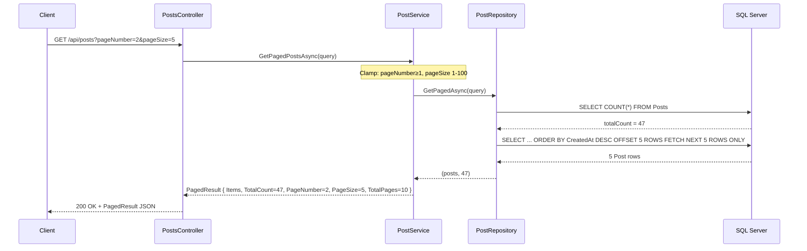
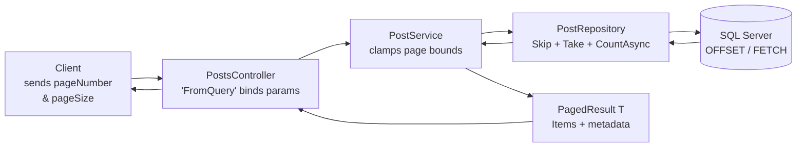

# Pagination in DevConnect

## Status
✅ Implemented

---

## What is Pagination?

Pagination splits a large dataset into smaller, fixed-size pages instead of returning every row at once. It reduces response size, database load, and client rendering time.

---

## Files Involved

| File | Role |
|------|------|
| [DevConnect/DTOs/PostInteractionDTO.cs](../DevConnect/DTOs/PostInteractionDTO.cs) | `PostQueryParams` (input) + `PagedResult<T>` (output) |
| [DevConnect/Interfaces/IPostRepository.cs](../DevConnect/Interfaces/IPostRepository.cs) | Contract for `GetPagedAsync` |
| [DevConnect/Interfaces/IPostService.cs](../DevConnect/Interfaces/IPostService.cs) | Contract for `GetPagedPostsAsync` |
| [DevConnect/Repositories/PostRepository.cs](../DevConnect/Repositories/PostRepository.cs) | EF Core `Skip` + `Take` + `CountAsync` |
| [DevConnect/Services/PostService.cs](../DevConnect/Services/PostService.cs) | Input clamping + mapping to `PagedResult<T>` |
| [DevConnect/Controllers/PostsController.cs](../DevConnect/Controllers/PostsController.cs) | `[FromQuery] PostQueryParams` on `GET /api/posts` |

---

## How It Is Implemented

### Step 1 — Input DTO (`PostInteractionDTO.cs`)
Holds the client's page/sort preferences with safe defaults:
```csharp
public class PostQueryParams
{
    public int    PageNumber    { get; set; } = 1;         // default: first page
    public int    PageSize      { get; set; } = 10;        // default: 10 per page
    public string SortBy        { get; set; } = "createdAt";
    public string SortDirection { get; set; } = "desc";
}
```

### Step 2 — Output DTO (`PostInteractionDTO.cs`)
Generic wrapper returned to the client with items + metadata:
```csharp
public class PagedResult<T>
{
    public List<T> Items      { get; set; } = [];
    public int     TotalCount { get; set; }
    public int     PageNumber { get; set; }
    public int     PageSize   { get; set; }
    public int     TotalPages => (int)Math.Ceiling((double)TotalCount / PageSize);  // computed
}
```

---

### Step 3 — Interface Contract (`IPostRepository.cs`)
```csharp
Task<(List<Post> Posts, int TotalCount)> GetPagedAsync(PostQueryParams query);
```

---

### Step 4 — Repository (`PostRepository.cs`)
Builds an `IQueryable`, applies sorting, counts total (before paging), then pages:
```csharp
public async Task<(List<Post> Posts, int TotalCount)> GetPagedAsync(PostQueryParams query)
{
    var q = _context.Posts
        .Include(p => p.User)
        .Include(p => p.Likes)
        .Include(p => p.Comments)
        .AsQueryable();                     // deferred — no SQL yet

    // --- Sorting applied first (see Sorting.md) ---
    q = (query.SortBy.ToLower(), query.SortDirection.ToLower()) switch { ... };

    var totalCount = await q.CountAsync();  // SQL: SELECT COUNT(*) — before paging

    var posts = await q
        .Skip((query.PageNumber - 1) * query.PageSize)   // offset
        .Take(query.PageSize)                             // limit
        .ToListAsync();                                   // SQL executes here

    return (posts, totalCount);
}
```

**Generated SQL (example — page 2, size 10):**
```sql
SELECT COUNT(*) FROM Posts
SELECT * FROM Posts ORDER BY CreatedAt DESC OFFSET 10 ROWS FETCH NEXT 10 ROWS ONLY
```

---

### Step 5 — Service (`PostService.cs`)
Clamps bounds to prevent abuse, delegates to repo, maps to DTO:
```csharp
public async Task<PagedResult<PostResponseDTO>> GetPagedPostsAsync(PostQueryParams query)
{
    query.PageNumber = Math.Max(1, query.PageNumber);         // floor: never < 1
    query.PageSize   = Math.Clamp(query.PageSize, 1, 100);   // range: 1–100

    var (posts, totalCount) = await _repo.GetPagedAsync(query);

    return new PagedResult<PostResponseDTO>
    {
        Items      = _mapper.Map<List<PostResponseDTO>>(posts),
        TotalCount = totalCount,
        PageNumber = query.PageNumber,
        PageSize   = query.PageSize
        // TotalPages is computed automatically by the property getter
    };
}
```

---

### Step 6 — Controller (`PostsController.cs`)
ASP.NET Core automatically binds query string values into `PostQueryParams`:
```csharp
[HttpGet]
[OutputCache(PolicyName = "Posts")]
public async Task<IActionResult> GetAll([FromQuery] PostQueryParams query) =>
    Ok(await _postService.GetPagedPostsAsync(query));
```

---

## Example Requests & Responses

**Request:**
```
GET /api/posts?pageNumber=2&pageSize=5
```

**Response:**
```json
{
  "items": [ ...5 posts... ],
  "totalCount": 47,
  "pageNumber": 2,
  "pageSize": 5,
  "totalPages": 10
}
```

**Default (no query string):**
```
GET /api/posts   →  page 1, size 10, sorted by createdAt desc
```

---

## Pagination Flow Diagram



---

## Layer Responsibility Summary


