# DevConnect Project Structure

Generated on 2026-05-19.

> Scope: build outputs and hidden tooling folders such as `bin/`, `obj/`, `.vs/`, and `.git/` are intentionally omitted.

## Structure Graph

```mermaid
flowchart TD
    Root["DevConnect repository"]
    Root --> Sln["DevConnect.sln"]
    Root --> Readme["README.md"]
    Root --> Gitignore[".gitignore"]
    Root --> Docs["Docs/"]
    Root --> App["DevConnect/"]

    Docs --> DocsArchitecture["Architecture.md"]
    Docs --> DocsAuthSecurity["AuthSecurity.md"]
    Docs --> DocsCors["CORS.md"]
    Docs --> DocsDatabase["Database.md"]
    Docs --> DocsNotes["Notes.md"]
    Docs --> DocsStudy["Stydy-Note/"]
    DocsStudy --> StudyAdvanced["CSharp-Advanced.md"]
    DocsStudy --> StudyBeginner["CSharp-Beginner.md"]
    DocsStudy --> StudyInterview["CSharp-InterviewQA.md"]

    App --> AppSettings["appsettings.json"]
    App --> AppSettingsDev["appsettings.Development.json"]
    App --> Csproj["DevConnect.csproj"]
    App --> CsprojUser["DevConnect.csproj.user"]
    App --> Http["DevConnect.http"]
    App --> Program["Program.cs"]
    App --> Weather["WeatherForecast.cs"]
    App --> Controllers["Controllers/"]
    App --> Data["Data/"]
    App --> DTOs["DTOs/"]
    App --> Interfaces["Interfaces/"]
    App --> Mappings["Mappings/"]
    App --> Migrations["Migrations/"]
    App --> Models["Models/"]
    App --> Properties["Properties/"]
    App --> Repositories["Repositories/"]
    App --> Services["Services/"]
    App --> Validators["Validators/"]

    Controllers --> AuthController["AuthController.cs"]
    Controllers --> BooksController["BooksController.cs"]
    Controllers --> CommentsController["CommentsController.cs"]
    Controllers --> LikesController["LikesController.cs"]
    Controllers --> PostsController["PostsController.cs"]
    Controllers --> UsersController["UsersController.cs"]
    Controllers --> WeatherForecastController["WeatherForecastController.cs"]

    Data --> DevConnectDbContext["DevConnectDbContext.cs"]
    Data --> FirstAPIContext["FirstAPIContext.cs"]

    DTOs --> PostInteractionDTO["PostInteractionDTO.cs"]
    DTOs --> UserDto["UserDto.cs"]

    Interfaces --> IAuthService["IAuthService.cs"]
    Interfaces --> IPostRepository["IPostRepository.cs"]
    Interfaces --> IPostService["IPostService.cs"]

    Mappings --> MappingProfile["MappingProfile.cs"]

    Migrations --> MigBookModel["20260421122813_book model added.cs"]
    Migrations --> MigBookModelDesigner["20260421122813_book model added.Designer.cs"]
    Migrations --> MigBookData["20260421124209_book data added.cs"]
    Migrations --> MigBookDataDesigner["20260421124209_book data added.Designer.cs"]
    Migrations --> FirstSnapshot["FirstAPIContextModelSnapshot.cs"]
    Migrations --> DevConnectDb["DevConnectDb/"]

    DevConnectDb --> MigUserAdded["20260427121252_user model added.cs"]
    DevConnectDb --> MigUserAddedDesigner["20260427121252_user model added.Designer.cs"]
    DevConnectDb --> MigUserJwt["20260428121049_user model updated with jwt.cs"]
    DevConnectDb --> MigUserJwtDesigner["20260428121049_user model updated with jwt.Designer.cs"]
    DevConnectDb --> MigPostAdded["20260504130346_post model added.cs"]
    DevConnectDb --> MigPostAddedDesigner["20260504130346_post model added.Designer.cs"]
    DevConnectDb --> MigLikesComments["20260505124425_likes and comments added.cs"]
    DevConnectDb --> MigLikesCommentsDesigner["20260505124425_likes and comments added.Designer.cs"]
    DevConnectDb --> MigOidcAdded["20260514130622_oidc fields added to user.cs"]
    DevConnectDb --> MigOidcAddedDesigner["20260514130622_oidc fields added to user.Designer.cs"]
    DevConnectDb --> DevConnectSnapshot["DevConnectDbContextModelSnapshot.cs"]

    Models --> BooksModel["Books.cs"]
    Models --> CommentModel["Comment.cs"]
    Models --> LikeModel["Like.cs"]
    Models --> PostModel["Post.cs"]
    Models --> UserModel["User.cs"]

    Properties --> LaunchSettings["launchSettings.json"]

    Repositories --> PostRepository["PostRepository.cs"]

    Services --> AuthService["AuthService.cs"]
    Services --> PostService["PostService.cs"]

    Validators --> AuthValidators["AuthValidators.cs"]
    Validators --> PostValidators["PostValidators.cs"]
```

## File Descriptions

### Root

| File | Description |
| --- | --- |
| [Git ignore rules file](../.gitignore) | Excludes build artifacts, local settings, and other generated files from source control. |
| [README.md](../README.md) | High-level project overview, setup instructions, and API usage notes. |
| [DevConnect.sln](../DevConnect.sln) | Visual Studio solution file that ties the project together. |

### Docs

| File | Description |
| --- | --- |
| [Docs/Architecture.md](Architecture.md) | Notes on the project architecture, layering, and design choices. |
| [Docs/AuthSecurity.md](AuthSecurity.md) | Authentication and security notes, including JWT and identity flow. |
| [Docs/CORS.md](CORS.md) | Explains Cross-Origin Resource Sharing setup and behavior in the API. |
| [Docs/Database.md](Database.md) | Database and Entity Framework Core notes for the project. |
| [Docs/RequestFlow.md](RequestFlow.md) | End-to-end API request flow: Program.cs → middleware → controller → service → repository → DB. |
| [Docs/Notes.md](Notes.md) | General development notes collected while building the API. |

### Docs/Study-Note

| File | Description |
| --- | --- |
| [Advanced C# study notes](Stydy-Note/CSharp-Advanced.md) | Advanced C# concepts and deeper language features. |
| [Beginner C# study notes](Stydy-Note/CSharp-Beginner.md) | Beginner-friendly C# fundamentals and syntax notes. |
| [C# interview study notes](Stydy-Note/CSharp-InterviewQA.md) | C# interview questions and revision notes. |

### DevConnect project root

| File | Description |
| --- | --- |
| [Main app config JSON](../DevConnect/appsettings.json) | Main application configuration for shared, non-secret settings. |
| [Development app config JSON](../DevConnect/appsettings.Development.json) | Development-only configuration for local secrets and overrides. |
| [Project file](../DevConnect/DevConnect.csproj) | .NET project file that defines target framework, package references, and build settings. |
| [Local IDE settings](../DevConnect/DevConnect.csproj.user) | User-specific IDE settings that should stay local. |
| [HTTP request samples](../DevConnect/DevConnect.http) | Sample HTTP requests for testing the API from the editor. |
| [DevConnect/Program.cs](../DevConnect/Program.cs) | Application entry point and service/middleware registration. |
| [DevConnect/WeatherForecast.cs](../DevConnect/WeatherForecast.cs) | Sample model used by the default template weather endpoint. |

### DevConnect/Controllers

| File | Description |
| --- | --- |
| [DevConnect/Controllers/AuthController.cs](../DevConnect/Controllers/AuthController.cs) | Handles authentication endpoints such as register, login, and token-related flows. |
| [DevConnect/Controllers/BooksController.cs](../DevConnect/Controllers/BooksController.cs) | Exposes CRUD endpoints for the books learning feature. |
| [DevConnect/Controllers/CommentsController.cs](../DevConnect/Controllers/CommentsController.cs) | Manages comment endpoints for posts. |
| [DevConnect/Controllers/LikesController.cs](../DevConnect/Controllers/LikesController.cs) | Handles post like and unlike operations. |
| [DevConnect/Controllers/PostsController.cs](../DevConnect/Controllers/PostsController.cs) | Provides post CRUD and user-specific post endpoints. |
| [DevConnect/Controllers/UsersController.cs](../DevConnect/Controllers/UsersController.cs) | Manages user profile and admin user endpoints. |
| [DevConnect/Controllers/WeatherForecastController.cs](../DevConnect/Controllers/WeatherForecastController.cs) | Default sample controller from the ASP.NET Core template. |

### DevConnect/Data

| File | Description |
| --- | --- |
| [DevConnect/Data/DevConnectDbContext.cs](../DevConnect/Data/DevConnectDbContext.cs) | Primary Entity Framework Core context for the main application data model. |
| [DevConnect/Data/FirstAPIContext.cs](../DevConnect/Data/FirstAPIContext.cs) | Earlier EF Core context used for the books learning example. |

### DevConnect/DTOs

| File | Description |
| --- | --- |
| [Post interaction payloads](../DevConnect/DTOs/PostInteractionDTO.cs) | Data transfer shapes for post interaction features such as likes and comments. |
| [User transfer payloads](../DevConnect/DTOs/UserDto.cs) | User and auth-related data shapes used for request and response payloads. |

### DevConnect/Interfaces

| File | Description |
| --- | --- |
| [DevConnect/Interfaces/IAuthService.cs](../DevConnect/Interfaces/IAuthService.cs) | Contract for authentication-related service operations. |
| [DevConnect/Interfaces/IPostRepository.cs](../DevConnect/Interfaces/IPostRepository.cs) | Contract for post data access operations. |
| [DevConnect/Interfaces/IPostService.cs](../DevConnect/Interfaces/IPostService.cs) | Contract for post business logic operations. |

### DevConnect/Mappings

| File | Description |
| --- | --- |
| [DevConnect/Mappings/MappingProfile.cs](../DevConnect/Mappings/MappingProfile.cs) | AutoMapper profile that maps between models and DTOs. |

### DevConnect/Migrations

| File | Description |
| --- | --- |
| [DevConnect/Migrations/20260421122813_book model added.cs](../DevConnect/Migrations/20260421122813_book%20model%20added.cs) | EF Core migration that adds the initial book model. |
| [DevConnect/Migrations/20260421122813_book model added.Designer.cs](../DevConnect/Migrations/20260421122813_book%20model%20added.Designer.cs) | Designer file for the initial book model migration. |
| [DevConnect/Migrations/20260421124209_book data added.cs](../DevConnect/Migrations/20260421124209_book%20data%20added.cs) | EF Core migration that seeds or updates book data. |
| [DevConnect/Migrations/20260421124209_book data added.Designer.cs](../DevConnect/Migrations/20260421124209_book%20data%20added.Designer.cs) | Designer file for the book data migration. |
| [DevConnect/Migrations/FirstAPIContextModelSnapshot.cs](../DevConnect/Migrations/FirstAPIContextModelSnapshot.cs) | EF Core snapshot for the older FirstAPIContext schema. |

### DevConnect/Migrations/DevConnectDb

| File | Description |
| --- | --- |
| [DevConnect/Migrations/DevConnectDb/20260427121252_user model added.cs](../DevConnect/Migrations/DevConnectDb/20260427121252_user%20model%20added.cs) | EF Core migration that introduces the user model. |
| [DevConnect/Migrations/DevConnectDb/20260427121252_user model added.Designer.cs](../DevConnect/Migrations/DevConnectDb/20260427121252_user%20model%20added.Designer.cs) | Designer file for the initial user model migration. |
| [User authentication update migration](../DevConnect/Migrations/DevConnectDb/20260428121049_user%20model%20updated%20with%20jwt.cs) | EF Core migration that adds token-related user fields. |
| [User authentication update designer](../DevConnect/Migrations/DevConnectDb/20260428121049_user%20model%20updated%20with%20jwt.Designer.cs) | Designer file for the authentication user update migration. |
| [DevConnect/Migrations/DevConnectDb/20260504130346_post model added.cs](../DevConnect/Migrations/DevConnectDb/20260504130346_post%20model%20added.cs) | EF Core migration that adds the post model. |
| [DevConnect/Migrations/DevConnectDb/20260504130346_post model added.Designer.cs](../DevConnect/Migrations/DevConnectDb/20260504130346_post%20model%20added.Designer.cs) | Designer file for the post model migration. |
| [DevConnect/Migrations/DevConnectDb/20260505124425_likes and comments added.cs](../DevConnect/Migrations/DevConnectDb/20260505124425_likes%20and%20comments%20added.cs) | EF Core migration that adds likes and comments support. |
| [DevConnect/Migrations/DevConnectDb/20260505124425_likes and comments added.Designer.cs](../DevConnect/Migrations/DevConnectDb/20260505124425_likes%20and%20comments%20added.Designer.cs) | Designer file for the likes and comments migration. |
| [DevConnect/Migrations/DevConnectDb/20260514130622_oidc fields added to user.cs](../DevConnect/Migrations/DevConnectDb/20260514130622_oidc%20fields%20added%20to%20user.cs) | EF Core migration that adds OIDC-related user fields. |
| [DevConnect/Migrations/DevConnectDb/20260514130622_oidc fields added to user.Designer.cs](../DevConnect/Migrations/DevConnectDb/20260514130622_oidc%20fields%20added%20to%20user.Designer.cs) | Designer file for the OIDC user migration. |
| [DevConnect/Migrations/DevConnectDb/DevConnectDbContextModelSnapshot.cs](../DevConnect/Migrations/DevConnectDb/DevConnectDbContextModelSnapshot.cs) | EF Core snapshot for the current DevConnectDb schema. |

### DevConnect/Models

| File | Description |
| --- | --- |
| [DevConnect/Models/Books.cs](../DevConnect/Models/Books.cs) | Book entity used by the learning example and EF Core demos. |
| [DevConnect/Models/Comment.cs](../DevConnect/Models/Comment.cs) | Comment entity tied to posts and users. |
| [DevConnect/Models/Like.cs](../DevConnect/Models/Like.cs) | Like entity used to record post reactions. |
| [DevConnect/Models/Post.cs](../DevConnect/Models/Post.cs) | Main post entity for the social-style API. |
| [DevConnect/Models/User.cs](../DevConnect/Models/User.cs) | User entity that stores identity, auth, and profile data. |

### DevConnect/Properties

| File | Description |
| --- | --- |
| [Launch profiles file](../DevConnect/Properties/launchSettings.json) | Launch profiles and environment settings for local debugging. |

### DevConnect/Repositories

| File | Description |
| --- | --- |
| [DevConnect/Repositories/PostRepository.cs](../DevConnect/Repositories/PostRepository.cs) | EF Core repository that handles post persistence and queries. |

### DevConnect/Services

| File | Description |
| --- | --- |
| [DevConnect/Services/AuthService.cs](../DevConnect/Services/AuthService.cs) | Authentication service that generates tokens and handles OIDC user resolution. |
| [DevConnect/Services/PostService.cs](../DevConnect/Services/PostService.cs) | Business logic for creating, updating, reading, and deleting posts. |

### DevConnect/Validators

| File | Description |
| --- | --- |
| [DevConnect/Validators/AuthValidators.cs](../DevConnect/Validators/AuthValidators.cs) | FluentValidation rules for register and login request models. |
| [DevConnect/Validators/PostValidators.cs](../DevConnect/Validators/PostValidators.cs) | FluentValidation rules for post and comment request models. |
