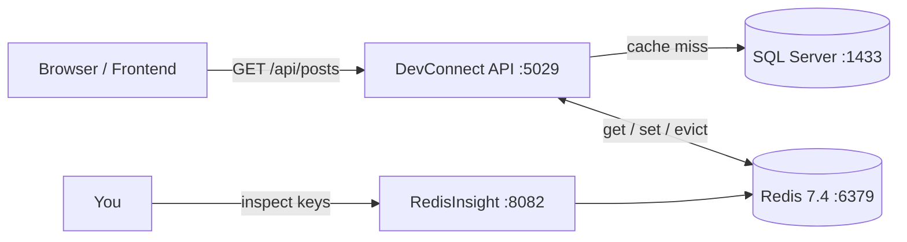

# Redis in DevConnect (Docker + UI + Store)

## Status
📋 Guide only — **no code has been changed.** Follow the steps below to implement.

---

## Goal

Run Redis as a **container** (the *store*) with a **web UI** to inspect keys, then point the
ASP.NET Core backend at it so caching becomes **distributed** (survives app restarts and works
across multiple API instances) instead of the current **in-process** output cache.

> Today DevConnect uses in-memory output caching (see [Caching.md](Caching.md)). The last note there
> already says: *"consider Redis-backed distributed cache for multi-instance deployments."* This is that upgrade.

---

## Pinned Versions (use these exact tags)

| Purpose | Image | Pinned Tag | Why this version |
|---------|-------|-----------|------------------|
| **Store** (Redis server) | `redis` | `redis:7.4-alpine` | Stable 7.x, tiny Alpine image, still MIT-BSD licensed (avoids the Redis 8 licensing change) |
| **UI** (browser viewer) | `redis/redisinsight` | `redis/redisinsight:2.62` | Official Redis GUI, pinned to a fixed release (not `latest`) |
| .NET Redis client | `Microsoft.Extensions.Caching.StackExchangeRedis` | `8.0.x` | Match the project's **`net8.0`** target framework |
| .NET output-cache Redis | `Microsoft.AspNetCore.OutputCaching.StackExchangeRedis` | `8.0.x` | Redis-backed store for the existing `[OutputCache]` policy |

> ⚠️ **Version must match your target framework.** [DevConnect.csproj](../DevConnect/DevConnect.csproj)
> targets **`net8.0`**, so the ASP.NET Core Redis packages must be **`8.0.x`** — a `9.0.6` ASP.NET Core
> package requires the .NET 9 runtime and fails to install on a net8 project (NU1202). Use the latest
> `8.0.*` (e.g. `8.0.11`).

> Alternative UI: `rediscommander/redis-commander:latest` (lighter, form-based). RedisInsight is
> recommended because it shows TTLs, memory, and a CLI in one screen.

---

## Part 1 — Add the Store + UI to Docker Compose

Edit [docker-compose.yml](../docker-compose.yml) and add these **two services** alongside `db`,
`api`, and `adminer`.

```yaml
  # --- Redis store (the actual cache server) ---
  redis:
    image: redis:7.4-alpine
    container_name: devconnect-redis
    command: ["redis-server", "--appendonly", "yes"]   # persist to disk (AOF)
    ports:
      - "6379:6379"          # host access for redis-cli / debugging
    volumes:
      - redis-data:/data
    healthcheck:
      test: ["CMD", "redis-cli", "ping"]
      interval: 10s
      timeout: 5s
      retries: 10
      start_period: 10s

  # --- RedisInsight web UI --> http://localhost:8082 ---
  redis-ui:
    image: redis/redisinsight:2.62
    container_name: devconnect-redis-ui
    depends_on:
      redis:
        condition: service_healthy
    ports:
      - "8082:5540"          # RedisInsight listens on 5540 inside the container
    volumes:
      - redisinsight-data:/data
```

Then extend the existing `volumes:` block at the bottom of the file:

```yaml
volumes:
  mssql-data:
  redis-data:          # <-- add
  redisinsight-data:   # <-- add
```

Finally, make the **api** service depend on Redis and pass the connection string.
Inside the existing `api:` service, add Redis under `depends_on` and a new env var:

```yaml
  api:
    # ...existing build/ports/environment...
    depends_on:
      db:
        condition: service_healthy
      redis:                       # <-- add
        condition: service_healthy # <-- add
    environment:
      # ...existing ASPNETCORE_*, ConnectionStrings__DefaultConnection, JwtSettings__Key...
      # Redis connection string (double-underscore maps to Redis:ConnectionString in config)
      Redis__ConnectionString: "redis:6379"   # <-- add ("redis" = the service name, NOT localhost)
```

> ⚠️ Inside Docker the API reaches Redis at host name **`redis`** (the service name), not `localhost`.
> `localhost:6379` only works when you run the API on your machine outside Docker.

---

## Part 2 — Add the NuGet Packages

Run these from the [DevConnect](../DevConnect) project folder (not the solution root):

```powershell
cd DevConnect
dotnet add package Microsoft.Extensions.Caching.StackExchangeRedis --version 8.0.11
dotnet add package Microsoft.AspNetCore.OutputCaching.StackExchangeRedis --version 8.0.11
dotnet add package AspNetCore.HealthChecks.Redis --version 8.0.1   # production: readiness probe
```

> ⚠️ Use **8.0.x** (matches the `net8.0` target). The earlier `9.0.6` command **fails** on this
> project — `Microsoft.AspNetCore.OutputCaching.StackExchangeRedis 9.0.6` needs the .NET 9 shared
> framework. If you already ran the 9.0.6 line, downgrade the Extensions.Caching package too:
> `dotnet add package Microsoft.Extensions.Caching.StackExchangeRedis --version 8.0.11`.

---

## Part 3 — Configuration Value (production-grade)

**Golden rule: no secrets in `appsettings.json` and nothing committed to git.** The file holds only
non-secret defaults; the real connection string (with password/TLS) comes from the environment per stage.

**a) `appsettings.json` — safe local default only:**
```jsonc
{
  // ...existing settings...
  "Redis": {
    "ConnectionString": "localhost:6379",   // dev only, no password
    "InstanceName": "devconnect:"            // key prefix (namespacing)
  }
}
```

**b) Local dev secrets — use User Secrets, never the JSON file:**
```powershell
cd DevConnect
dotnet user-secrets init
dotnet user-secrets set "Redis:ConnectionString" "localhost:6379,password=devpass,abortConnect=false"
```

**c) Docker / server — inject via environment variable** (double-underscore = config nesting):
```yaml
# in the api service (compose / your orchestrator)
Redis__ConnectionString: "redis:6379,password=${REDIS_PASSWORD},abortConnect=false,ssl=false"
```

**d) Real production (cloud)** — pull the connection string from a secret manager
(Azure Key Vault, AWS Secrets Manager, Kubernetes Secret) and enable TLS:
```
redis-prod.example.net:6380,password=<from-vault>,ssl=true,abortConnect=false,connectRetry=5,connectTimeout=5000
```

| Key parameter | Why it matters in production |
|---------------|------------------------------|
| `password=...` | Redis must require auth (never run open) |
| `ssl=true` | Encrypt traffic in transit (managed Redis uses port `6380`) |
| `abortConnect=false` | App starts even if Redis is briefly unavailable, then reconnects |
| `connectRetry` / `connectTimeout` | Resilience against transient network blips |

---

## Part 4 — Wire Redis into `Program.cs`

Open [DevConnect/Program.cs](../DevConnect/Program.cs). You have **two options** — you can do
either or both.

### Option A — Redis-backed **output cache** (replaces the in-memory `[OutputCache]` store)

Your current registration looks like this:

```csharp
builder.Services.AddOutputCache(options =>
{
    options.AddPolicy("Posts", builder =>
        builder.Expire(TimeSpan.FromSeconds(30))
               .Tag("posts"));
});
```

Add **one line before it** so the output cache uses Redis instead of memory
(no other changes — the `[OutputCache(PolicyName = "Posts")]` attributes and `EvictByTagAsync`
in [PostsController.cs](../DevConnect/Controllers/PostsController.cs) keep working as-is):

```csharp
builder.Services.AddStackExchangeRedisOutputCache(options =>
{
    options.Configuration = builder.Configuration["Redis:ConnectionString"];
    options.InstanceName = "devconnect-oc:";
});

builder.Services.AddOutputCache(options =>          // <-- your existing block, unchanged
{
    options.AddPolicy("Posts", builder =>
        builder.Expire(TimeSpan.FromSeconds(30))
               .Tag("posts"));
});
```

### Option B — General-purpose `IDistributedCache` (for caching arbitrary data yourself)

```csharp
builder.Services.AddStackExchangeRedisCache(options =>
{
    options.Configuration = builder.Configuration["Redis:ConnectionString"];
    options.InstanceName = "devconnect:";
});
```

Then inject `IDistributedCache` wherever you want manual caching:

```csharp
public class SomeService
{
    private readonly IDistributedCache _cache;
    public SomeService(IDistributedCache cache) => _cache = cache;

    public async Task<string?> GetOrSetAsync()
    {
        var cached = await _cache.GetStringAsync("my-key");
        if (cached is not null) return cached;

        var fresh = "computed value";
        await _cache.SetStringAsync("my-key", fresh, new DistributedCacheEntryOptions
        {
            AbsoluteExpirationRelativeToNow = TimeSpan.FromMinutes(5)
        });
        return fresh;
    }
}
```

> The existing `app.UseOutputCache();` middleware line stays exactly where it is (before
> `UseAuthentication`). No middleware change is needed for either option.

---

## Part 5 — Build & Run

```powershell
# from the repo root (where docker-compose.yml lives)
docker compose build api      # rebuild only if you added packages / changed code
docker compose up -d
```

Because you added NuGet packages, the api image must be rebuilt. On the Philips network the
`dotnet restore` inside the Docker build can fail with **NU1301 / TLS "unknown CA"** (Cisco Umbrella
SSL inspection). Fix per the repo note: the corporate root CA must be copied into the build stage
of [DevConnect/Dockerfile](../DevConnect/Dockerfile) **before** `dotnet restore`. Redis and
RedisInsight images pull fine from Docker Hub.

---

## Part 6 — Verify

### Check the store is up (CLI)
```powershell
docker exec -it devconnect-redis redis-cli ping    # -> PONG
docker exec -it devconnect-redis redis-cli keys "*" # lists cache keys once you hit an endpoint
```

### Check the UI
1. Open **http://localhost:8082** (RedisInsight).
2. **Add Redis database** → Host: `redis`, Port: `6379` (RedisInsight runs *inside* Docker, so it
   reaches the store by service name). If that fails, use Host `host.docker.internal`, Port `6379`.
3. Browse keys — after calling `GET /api/posts` you should see keys prefixed with
   `devconnect-oc:` (Option A) or `devconnect:` (Option B).

### Prove it is distributed
1. `GET http://localhost:5029/api/posts` (fills the cache).
2. `docker compose restart api`.
3. `GET http://localhost:5029/api/posts` again — with Redis the cache **survives** the restart
   (in-memory caching would have been empty).

---

## Part 7 — Production-Grade Hardening

Everything above gets Redis *working*. The items below are what separate a demo from a
production deployment. Each is optional but recommended.

### 7.1 — Resilient connection (don't crash if Redis is down)
Use `ConfigurationOptions` so the app degrades gracefully instead of failing to start when Redis
is briefly unavailable:

```csharp
var redisConn = builder.Configuration["Redis:ConnectionString"]!;
builder.Services.AddStackExchangeRedisCache(options =>
{
    options.ConfigurationOptions = StackExchange.Redis.ConfigurationOptions.Parse(redisConn);
    options.ConfigurationOptions.AbortOnConnectFail = false;   // keep retrying, don't throw at startup
    options.ConfigurationOptions.ConnectRetry       = 5;
    options.ConfigurationOptions.ConnectTimeout     = 5000;
    options.InstanceName = builder.Configuration["Redis:InstanceName"] ?? "devconnect:";
});
```

> **Cache-aside pattern:** wrap cache reads in `try/catch`. A cache miss *or* a Redis outage should
> fall back to the database — the cache is an optimization, never a hard dependency.

### 7.2 — Health checks (readiness probe)
Expose Redis health so Docker/Kubernetes/load-balancers know when the app is truly ready:

```csharp
builder.Services.AddHealthChecks()
    .AddRedis(builder.Configuration["Redis:ConnectionString"]!, name: "redis");

// after var app = builder.Build();
app.MapHealthChecks("/health");
```

Then point the API container's healthcheck at `/health` instead of assuming it's up.

### 7.3 — Harden the Redis container
The Part 1 compose is dev-friendly. For production, replace the `redis` service with:

```yaml
  redis:
    image: redis:7.4-alpine
    container_name: devconnect-redis
    command:
      - "redis-server"
      - "--appendonly"
      - "yes"
      - "--requirepass"           # REQUIRE a password
      - "${REDIS_PASSWORD}"
      - "--maxmemory"
      - "512mb"                   # cap memory
      - "--maxmemory-policy"
      - "allkeys-lru"             # evict least-recently-used keys when full (correct for a cache)
    # NO host port in production — only the api container needs Redis (internal network)
    # ports: []                   # <-- remove the "6379:6379" mapping
    volumes:
      - redis-data:/data
    restart: unless-stopped
    deploy:
      resources:
        limits:
          memory: 640M            # container ceiling slightly above maxmemory
    healthcheck:
      test: ["CMD", "redis-cli", "-a", "${REDIS_PASSWORD}", "ping"]
      interval: 10s
      timeout: 5s
      retries: 10
      start_period: 10s
```

| Hardening | Why |
|-----------|-----|
| `--requirepass` | Never run Redis unauthenticated |
| Remove host `ports` | Don't expose the cache to the host/internet; only the API (same Docker network) reaches it |
| `--maxmemory` + `allkeys-lru` | Bounded memory; auto-evict old keys so Redis never OOMs |
| `restart: unless-stopped` | Auto-recover after a crash/reboot |
| `deploy.resources.limits` | Prevent Redis from starving other containers |
| TLS (`ssl=true`, port 6380) | Encrypt traffic (use managed Redis or a TLS proxy like stunnel) |

> The **UI (RedisInsight) should NOT be deployed to production** — it's a debugging tool. Run it only
> locally, or protect it behind auth/VPN. Never expose port 8082 publicly.

### 7.4 — Choose a caching strategy deliberately
| Concern | Recommendation |
|---------|----------------|
| TTLs | Set an **absolute expiration** on every entry so stale data self-heals |
| Key names | Namespace with `InstanceName` per environment (`devconnect-prod:`, `devconnect-staging:`) so stages never collide on shared Redis |
| Serialization | `System.Text.Json` for stored objects; keep payloads small |
| Invalidation | Keep the existing tag-based `EvictByTagAsync("posts")` on writes — it already prevents stale reads |
| What to cache | Read-heavy, rarely-changing public data (post lists). **Never** cache per-user/authorized responses in a shared key |

### 7.5 — Observability
- Log cache hits/misses (Serilog is already wired in) to measure hit ratio.
- Watch `used_memory`, `evicted_keys`, `keyspace_hits/misses` via `redis-cli INFO` or RedisInsight.
- Alert on connection failures surfaced by the `/health` endpoint.

---

## How It Fits Together



| Container | Role | Host Port | In-Docker Host Name |
|-----------|------|-----------|--------------------|
| `devconnect-redis` | Cache store | 6379 | `redis` |
| `devconnect-redis-ui` | Web UI | 8082 | `redis-ui` |
| `devconnect-api` | Backend | 5029 | `api` |
| `devconnect-db` | SQL Server | 1433 | `db` |

---

## Key Points

- **Pin versions** (`redis:7.4-alpine`, `redis/redisinsight:2.62`) — avoid `latest` so builds are reproducible.
- Redis **7.4** stays on the permissive license; Redis **8.x** changed licensing — stick to 7.x unless you accept that.
- Inside Docker use the **service name** `redis`, not `localhost`.
- Option A needs **zero controller changes** — it just swaps where the existing output cache is stored.
- Rebuild the `api` image after adding packages; mind the **corporate CA** step in the Dockerfile.
- Match package versions to **9.0.6** to avoid NU1605 build errors.
```
