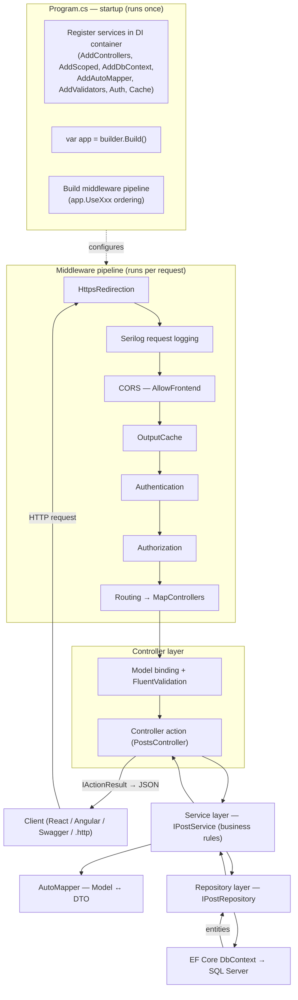
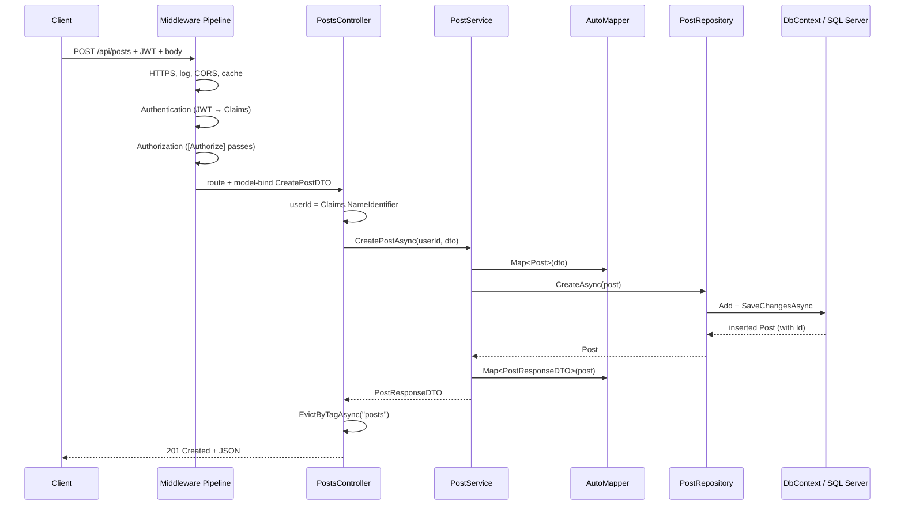

# API Request Flow in DevConnect

How a single HTTP request travels through the application — from `Program.cs`
startup, through the middleware pipeline, into a controller, down to the service
and repository, out to the database, and back as a JSON response.

> Reference code: [Program.cs](../DevConnect/Program.cs),
> [PostsController.cs](../DevConnect/Controllers/PostsController.cs),
> [PostService.cs](../DevConnect/Services/PostService.cs),
> [PostRepository.cs](../DevConnect/Repositories/PostRepository.cs).

---

## 1. Big Picture



---

## 2. Startup Phase — `Program.cs` (runs once)

Two things happen before the app can serve requests: **service registration** and
**pipeline construction**.

### 2a. Register services in the DI container

Everything a request will need is registered up front so it can be injected later.

| Registration | Purpose | Lifetime |
|--------------|---------|----------|
| `AddControllers()` | MVC controllers + JSON formatting | — |
| `AddScoped<IPostRepository, PostRepository>()` | Data access | Scoped (one per request) |
| `AddScoped<IPostService, PostService>()` | Business logic | Scoped |
| `AddScoped<IAuthService, AuthService>()` | Auth logic | Scoped |
| `AddAutoMapper(typeof(MappingProfile))` | Model ↔ DTO mapping | Singleton |
| `AddValidatorsFromAssemblyContaining<RegisterValidator>()` | FluentValidation rules | — |
| `AddDbContext<DevConnectDbContext>(...)` | EF Core + SQL Server | Scoped |
| `AddCors(...)` | `AllowFrontend` policy | — |
| `AddAuthentication().AddJwtBearer().AddGoogle().AddGitHub()` | JWT + OIDC | — |
| `AddOutputCache(...)` | `Posts` cache policy (30s, tag `posts`) | — |
| `AddSwaggerGen(...)` | OpenAPI docs + JWT auth button | — |

> **Scoped** means one instance is created per HTTP request and shared across all
> layers in that request — so the controller, service, and repository all use the
> **same** `DbContext`.

### 2b. Build the middleware pipeline

After `var app = builder.Build();`, the `app.UseXxx(...)` calls define the order
in which middleware runs. **Order matters.**

```csharp
if (app.Environment.IsDevelopment())
{
    app.UseSwagger();
    app.UseSwaggerUI();
}

app.UseHttpsRedirection();
app.UseSerilogRequestLogging(); // logs method, path, status, elapsed ms
app.UseCors("AllowFrontend");   // Must be before Authentication & Authorization
app.UseOutputCache();
app.UseAuthentication();        // who are you?  (reads JWT → User.Claims)
app.UseAuthorization();         // are you allowed?  ([Authorize])

app.MapControllers();           // route to the matching controller action

app.Run();
```

---

## 3. Per-Request Phase — Middleware Pipeline

Each incoming request passes through the middleware **in order**. Any middleware
can short-circuit the request (e.g. CORS rejection, `401` from authentication,
a cache hit) and return early without reaching the controller.

| # | Middleware | What it does | Can stop the request? |
|---|------------|--------------|------------------------|
| 1 | `UseHttpsRedirection` | Redirects HTTP → HTTPS | Yes (redirect) |
| 2 | `UseSerilogRequestLogging` | Logs method, path, status, elapsed ms | No |
| 3 | `UseCors("AllowFrontend")` | Applies allowed origins/headers/methods | Yes (blocked origin) |
| 4 | `UseOutputCache` | Serves a cached response if fresh | **Yes (cache hit → returns early)** |
| 5 | `UseAuthentication` | Validates JWT, populates `User.Claims` | No (just identifies) |
| 6 | `UseAuthorization` | Enforces `[Authorize]` / roles | **Yes (401 / 403)** |
| 7 | `MapControllers` | Routing → selects controller action | — |

---

## 4. Controller Layer — `PostsController`

Once routing selects an action, the framework:

1. **Constructs the controller** via DI — injecting `IPostService` and `IOutputCacheStore`.
2. **Model-binds** route/query/body values into parameters (e.g. `CreatePostDTO dto`,
   `PostQueryParams query`).
3. **Reads identity** from the validated JWT claims when needed:
   ```csharp
   var userId = int.Parse(User.FindFirstValue(ClaimTypes.NameIdentifier)!);
   ```
4. **Delegates** to the service — the controller contains no business logic.
5. **Returns an `IActionResult`** (`Ok`, `NotFound`, `NoContent`, `CreatedAtAction`),
   which is serialized to JSON.

Example — `POST api/posts`:

```csharp
[HttpPost]
[Authorize]
public async Task<IActionResult> Create(CreatePostDTO dto)
{
    var userId = int.Parse(User.FindFirstValue(ClaimTypes.NameIdentifier)!);
    var post = await _postService.CreatePostAsync(userId, dto);
    await _cache.EvictByTagAsync("posts", HttpContext.RequestAborted); // invalidate cache
    return CreatedAtAction(nameof(GetById), new { id = post.Id }, post);
}
```

> Read endpoints (`GetAll`, `GetById`) use `[OutputCache(PolicyName = "Posts")]`.
> Write endpoints (`Create`, `Update`, `Delete`) call `EvictByTagAsync("posts")`
> so cached lists stay consistent.

---

## 5. Service Layer — `PostService`

The service holds **business rules** and coordinates AutoMapper + the repository.
It never touches the `DbContext` directly.

```csharp
public async Task<PostResponseDTO> CreatePostAsync(int userId, CreatePostDTO dto)
{
    var post = _mapper.Map<Post>(dto);           // DTO → Model
    post.UserId = userId;                        // assign owner
    var created = await _repo.CreateAsync(post); // persist
    return _mapper.Map<PostResponseDTO>(created); // Model → DTO
}
```

Business rules enforced here (not in the controller or repository):

- **Ownership check** on update — `post.UserId != userId` → returns `false`.
- **Owner-or-Admin check** on delete — `post.UserId != userId && role != "Admin"`.
- **Paging safety** — clamps `PageNumber`/`PageSize` before querying.
- **Mapping** — converts between `Post` entities and `*DTO` shapes both ways.

---

## 6. Repository Layer — `PostRepository`

The repository is the **only** layer that talks to EF Core. It builds queries,
handles eager loading (`Include`), sorting, paging, and `SaveChangesAsync`.

```csharp
public async Task<Post> CreateAsync(Post post)
{
    _context.Posts.Add(post);
    await _context.SaveChangesAsync(); // EF Core generates INSERT → SQL Server
    return post;
}
```

Reads eager-load related data so DTOs can be fully populated:

```csharp
await _context.Posts
    .Include(p => p.User)
    .Include(p => p.Likes)
    .Include(p => p.Comments)
    .FirstOrDefaultAsync(p => p.Id == id);
```

---

## 7. Full Round Trip — `POST api/posts` Example



---

## 8. Layer Responsibilities (Quick Reference)

| Layer | Responsibility | Does NOT do |
|-------|----------------|-------------|
| **Program.cs** | Register services, build middleware pipeline | Handle requests |
| **Middleware** | HTTPS, logging, CORS, cache, auth, routing | Business logic |
| **Controller** | Bind input, read claims, return `IActionResult` | DB access / business rules |
| **Service** | Business rules, mapping, orchestration | Direct EF Core / `DbContext` |
| **AutoMapper** | Convert Model ↔ DTO | Persistence |
| **Repository** | EF Core queries, `SaveChangesAsync` | Business rules |
| **DbContext** | Translate LINQ → SQL, track entities | HTTP concerns |
