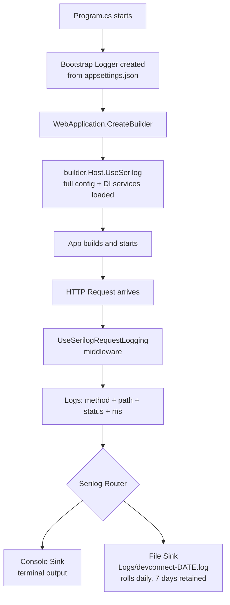
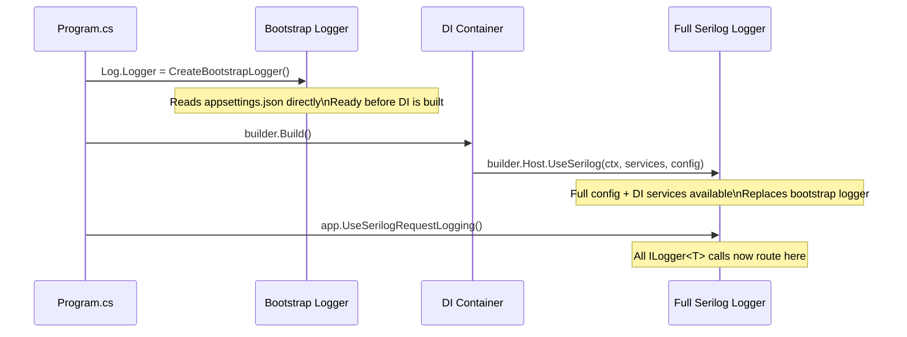

# Serilog in DevConnect

## Status
✅ Implemented

---

## What is Serilog?

Serilog is a structured logging library for .NET. Unlike the default `Console.WriteLine` or basic `ILogger`, Serilog writes **structured log events** — each log entry is a typed object with named properties, not just a plain string. This makes logs searchable and parseable by tools like Seq, Elastic, or Splunk.

---

## Files Involved

| File | Role |
|------|------|
| [DevConnect/Program.cs](../DevConnect/Program.cs) | Bootstrap logger, `UseSerilog`, `UseSerilogRequestLogging` |
| [DevConnect/appsettings.json](../DevConnect/appsettings.json) | `"Serilog"` configuration section — levels, sinks, enrichers |
| [DevConnect/DevConnect.csproj](../DevConnect/DevConnect.csproj) | NuGet packages |

---

## NuGet Packages Installed

```xml
<!-- DevConnect.csproj — installed via dotnet add package -->
Serilog.AspNetCore
Serilog.Settings.Configuration
Serilog.Sinks.Console
Serilog.Sinks.File
```

---

## How It Is Implemented

### Step 1 — Bootstrap Logger (`Program.cs`)
Created **before** `WebApplication.CreateBuilder` so startup errors (bad config, missing DB) are also captured:
```csharp
using Serilog;

Log.Logger = new LoggerConfiguration()
    .ReadFrom.Configuration(new ConfigurationBuilder()
        .AddJsonFile("appsettings.json")
        .Build())
    .CreateBootstrapLogger();
```

> `CreateBootstrapLogger()` is a two-stage initialisation — it creates a temporary logger that is replaced once the full DI container is built.

---

### Step 2 — Replace Host Logger (`Program.cs`)
Right after `WebApplication.CreateBuilder`, Serilog takes over as the host's logger and reads full config + DI services:
```csharp
var builder = WebApplication.CreateBuilder(args);

builder.Host.UseSerilog((ctx, services, config) =>
    config.ReadFrom.Configuration(ctx.Configuration)   // reads "Serilog" section
          .ReadFrom.Services(services));               // allows DI-aware sinks
```

---

### Step 3 — Request Logging Middleware (`Program.cs`)
Placed in the middleware pipeline to log one structured line per HTTP request:
```csharp
app.UseHttpsRedirection();
app.UseSerilogRequestLogging();    // ← logs: method, path, status code, elapsed ms
app.UseCors("AllowFrontend");
app.UseOutputCache();
```

Sample console output:
```
[16:04:22 INF] HTTP GET /api/posts responded 200 in 42.3 ms
[16:04:25 INF] HTTP POST /api/auth/login responded 200 in 18.1 ms
[16:04:31 WRN] HTTP DELETE /api/posts/99 responded 404 in 5.0 ms
```

---

### Step 4 — Configuration (`appsettings.json`)
```json
"Serilog": {
  "Using": [ "Serilog.Sinks.Console", "Serilog.Sinks.File" ],
  "MinimumLevel": {
    "Default": "Information",
    "Override": {
      "Microsoft": "Warning",
      "Microsoft.EntityFrameworkCore": "Warning"
    }
  },
  "WriteTo": [
    { "Name": "Console" },
    {
      "Name": "File",
      "Args": {
        "path": "Logs/devconnect-.log",
        "rollingInterval": "Day",
        "retainedFileCountLimit": 7
      }
    }
  ]
}
```

| Key | Meaning |
|-----|---------|
| `MinimumLevel.Default` | Log `Information` and above from your own code |
| `Override Microsoft` | Suppress noisy framework logs below `Warning` |
| `WriteTo Console` | Print to terminal |
| `WriteTo File` | Write to `Logs/devconnect-2026-06-02.log` |
| `rollingInterval: Day` | New file created each day |
| `retainedFileCountLimit: 7` | Keep last 7 days of log files, delete older |

---

### Step 5 — No Changes Needed in Controllers
Existing `ILogger<T>` usage automatically routes through Serilog:
```csharp
// WeatherForecastController.cs — already present, no changes needed
private readonly ILogger<WeatherForecastController> _logger;

public WeatherForecastController(ILogger<WeatherForecastController> logger)
{
    _logger = logger;  // this ILogger is backed by Serilog at runtime
}
```

You can use `_logger.LogInformation(...)`, `_logger.LogWarning(...)`, etc. anywhere — Serilog will handle writing them to all configured sinks.

---

## Log Levels

| Level | When to use | Example |
|-------|-------------|---------|
| `Verbose` | Extremely detailed (disabled in config) | Every EF Core query |
| `Debug` | Diagnostic info for developers | Variable values during login |
| `Information` | Normal operational events | Request handled, user registered |
| `Warning` | Unexpected but recoverable | 404 Not Found, validation failed |
| `Error` | Failures that need attention | DB connection failed |
| `Fatal` | App cannot continue | Startup crash |

---

## Serilog Startup + Request Flow Diagram



---

## Two-Stage Initialization Diagram



---

## Log Output Examples

**Console (Information):**
```
[2026-06-02 16:04:22 INF] HTTP GET /api/posts responded 200 in 42.3 ms
[2026-06-02 16:04:25 INF] HTTP POST /api/auth/login responded 200 in 18.1 ms
```

**Log File (`Logs/devconnect-20260602.log`):**
```
2026-06-02 16:04:22.341 +00:00 [INF] HTTP GET /api/posts responded 200 in 42.3 ms
2026-06-02 16:04:31.001 +00:00 [WRN] HTTP DELETE /api/posts/99 responded 404 in 5.0 ms
```

