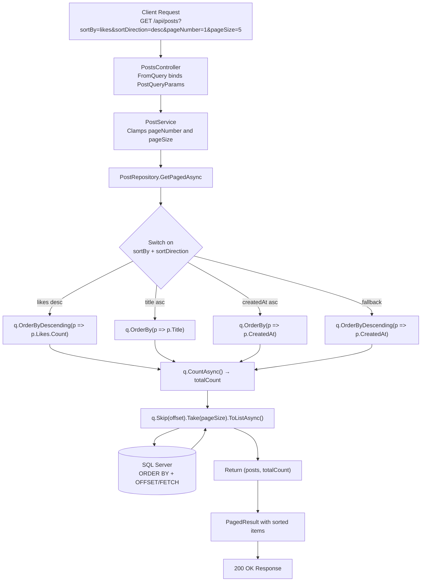

# Sorting in DevConnect

## Status
✅ Implemented

---

## What is Sorting?

Sorting lets the client control the order of returned results by specifying a field name and a direction (ascending / descending). It is applied **before** pagination so each page contains the correctly ordered slice of data.

---

## Files Involved

| File | Role |
|------|------|
| [DevConnect/DTOs/PostInteractionDTO.cs](../DevConnect/DTOs/PostInteractionDTO.cs) | `PostQueryParams` — holds `SortBy` + `SortDirection` |
| [DevConnect/Repositories/PostRepository.cs](../DevConnect/Repositories/PostRepository.cs) | Switch expression that applies `OrderBy` / `OrderByDescending` |
| [DevConnect/Services/PostService.cs](../DevConnect/Services/PostService.cs) | Passes `PostQueryParams` through to repository |
| [DevConnect/Controllers/PostsController.cs](../DevConnect/Controllers/PostsController.cs) | `[FromQuery]` binds sort params from URL |

---

## How It Is Implemented

### Step 1 — Sort Parameters in `PostQueryParams` (`PostInteractionDTO.cs`)
Sort fields live alongside page fields in the same input DTO:
```csharp
public class PostQueryParams
{
    public int    PageNumber    { get; set; } = 1;
    public int    PageSize      { get; set; } = 10;
    public string SortBy        { get; set; } = "createdAt";   // default field
    public string SortDirection { get; set; } = "desc";        // default direction
}
```

---

### Step 2 — Sorting Applied in Repository (`PostRepository.cs`)
Sorting is done inside `GetPagedAsync` using a C# **switch expression** on the tuple `(SortBy, SortDirection)`:
```csharp
q = (query.SortBy.ToLower(), query.SortDirection.ToLower()) switch
{
    ("title",     "asc")  => q.OrderBy(p => p.Title),
    ("title",     _)      => q.OrderByDescending(p => p.Title),
    ("likes",     "asc")  => q.OrderBy(p => p.Likes.Count),
    ("likes",     _)      => q.OrderByDescending(p => p.Likes.Count),
    ("createdat", "asc")  => q.OrderBy(p => p.CreatedAt),
    _                     => q.OrderByDescending(p => p.CreatedAt),  // default fallback
};
```

> `.ToLower()` normalises client input so `"Title"`, `"title"`, `"TITLE"` all match.  
> The `_` wildcard in the second position catches any invalid direction and falls back to `desc`.  
> The final `_` catch-all handles any unrecognised `sortBy` value — always defaults to `createdAt desc`.

---

### Step 3 — Order Matters: Sort Before Paginate
In `GetPagedAsync`, sorting always happens **before** `Skip`/`Take`:
```csharp
// 1. Sort   ← applied first
q = (...) switch { ... };

// 2. Count  ← runs against sorted (but unpaged) query
var totalCount = await q.CountAsync();

// 3. Page   ← applied after sort
var posts = await q
    .Skip((query.PageNumber - 1) * query.PageSize)
    .Take(query.PageSize)
    .ToListAsync();
```

This ensures page 2 always contains items 11–20 of the **sorted** list.

---

## Supported Sort Options

| `sortBy` | `sortDirection` | Result |
|----------|-----------------|--------|
| `createdAt` (default) | `desc` (default) | Newest posts first |
| `createdAt` | `asc` | Oldest posts first |
| `title` | `asc` | A → Z |
| `title` | `desc` | Z → A |
| `likes` | `desc` | Most liked first |
| `likes` | `asc` | Least liked first |
| *(any other value)* | *(any)* | Falls back to `createdAt desc` |

---

## Example Requests

```
GET /api/posts?sortBy=likes&sortDirection=desc
GET /api/posts?sortBy=title&sortDirection=asc&pageNumber=1&pageSize=10
GET /api/posts                                   ← uses defaults: createdAt desc, page 1, size 10
```

---

## Sorting + Pagination Flow Diagram



---

## Why a Switch Expression (not `if/else`)?

| Approach | Problem |
|----------|---------|
| `if (sortBy == "title")` chain | Verbose, easy to miss a case |
| Dynamic reflection (`typeof(Post).GetProperty(sortBy)`) | Security risk — user-controlled reflection |
| Switch expression on `(sortBy, direction)` | Explicit, safe, all cases visible, compiler warns on overlap |

The switch approach whitelists only the fields we support. Any unknown value safely falls through to the `_` default.

