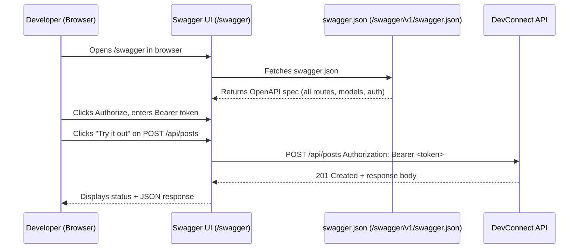
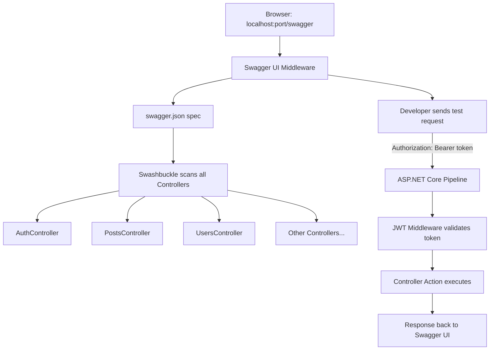

# Swagger / OpenAPI in DevConnect

## Status
✅ Implemented

---

## What is Swagger / OpenAPI?

**OpenAPI** is a standard specification for describing REST APIs. **Swagger** (via Swashbuckle) is a toolset that:
- Reads your controllers and attributes at runtime
- Generates an `openapi.json` spec automatically
- Renders an interactive browser UI at `/swagger`

---

## Files Involved

| File | Role |
|------|------|
| [DevConnect/Program.cs](../DevConnect/Program.cs) | Service registration + middleware |
| [DevConnect/DevConnect.csproj](../DevConnect/DevConnect.csproj) | `Swashbuckle.AspNetCore` package |
| [DevConnect/Properties/launchSettings.json](../DevConnect/Properties/launchSettings.json) | Sets `launchUrl` to `swagger` |

---

## How It Is Implemented

### Step 1 — NuGet Package
`DevConnect.csproj`:
```xml
<PackageReference Include="Swashbuckle.AspNetCore" Version="6.6.2" />
```

---

### Step 2 — Service Registration (`Program.cs`)
```csharp
builder.Services.AddEndpointsApiExplorer();   // required for minimal APIs + controllers

builder.Services.AddSwaggerGen(options =>
{
    // Document metadata shown at top of Swagger UI
    options.SwaggerDoc("v1", new OpenApiInfo { Title = "DevConnect API", Version = "v1" });

    // Adds the 🔒 Authorize button to Swagger UI
    options.AddSecurityDefinition("Bearer", new OpenApiSecurityScheme
    {
        Name        = "Authorization",
        Type        = SecuritySchemeType.Http,
        Scheme      = "Bearer",
        BearerFormat = "JWT",
        In          = ParameterLocation.Header,
        Description = "Enter your JWT token. Example: eyJhbGci..."
    });

    // Makes every endpoint require Bearer auth by default in the spec
    options.AddSecurityRequirement(new OpenApiSecurityRequirement
    {
        {
            new OpenApiSecurityScheme
            {
                Reference = new OpenApiReference
                {
                    Type = ReferenceType.SecurityScheme,
                    Id   = "Bearer"
                }
            },
            Array.Empty<string>()
        }
    });
});
```

---

### Step 3 — Middleware (`Program.cs`)
```csharp
if (app.Environment.IsDevelopment())
{
    app.UseSwagger();      // serves  GET /swagger/v1/swagger.json
    app.UseSwaggerUI();    // serves  GET /swagger  (browser UI)
}
```

> Swagger is enabled **only in Development** — it is never exposed in production.

---

### Step 4 — Launch Settings
`Properties/launchSettings.json` sets the browser to open directly on Swagger:
```json
"launchUrl": "swagger"
```

---

## Request Flow Through Swagger



---

## How JWT Auth Works in Swagger UI

```
1. Click 🔒 Authorize button in Swagger UI
2. Paste your JWT token (without "Bearer " prefix — Swashbuckle adds it)
3. Click Authorize → Close
4. All subsequent "Try it out" calls include:
       Authorization: Bearer eyJhbGci...
5. Protected endpoints (marked with [Authorize]) now respond instead of returning 401
```

---

## What Swagger Shows

| What | How Swagger gets it |
|------|---------------------|
| Route paths | `[Route]`, `[HttpGet]`, `[HttpPost]` attributes |
| Request body shape | DTO class (e.g. `CreatePostDTO`) |
| Response shape | Return type or `ProducesResponseType` attribute |
| Auth requirement | `AddSecurityRequirement` in `AddSwaggerGen` |
| Query parameters | `[FromQuery]` parameters (e.g. `PostQueryParams`) |

---

## Diagram — Swagger Integration in Project


